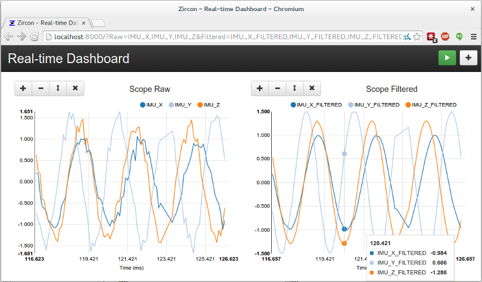

..  _client:

Client Applications
===================

.. NOTE::
   This documentation is a work in progress. Browse the code in ``zircon/zircon/frontend``.

A client is anyone who wants to access the data coming from Transceivers. It is
the end goal of Zircon to provide a fast, robust, and easy way for clients to
monitor the signals they are interested in. Clients can be web apps, mobile
apps, native apps, or hardware systems. Zircon's default client is a web dashboard
that allows real-time visualization of arbitrary signals. It is a Django application
with a JavaScript interface to the Socket.IO connection.

