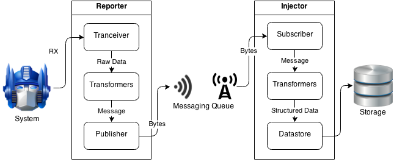

..  _overview:

Overview of Components
======================

Zircon consists of pluggable components useful individually or as a full stack
for decoding and logging, structured querying and analysis, real-time
visualization, and integration into custom applications. Components are connected
together to achieve a flexible data pipeline in centralized and distributed
scenarios.

:ref:`Transceivers <transceiver>`
  A Transceiver reads and/or writes to some source. It is the lowest-level
  component in zircon, which would for example interface with a CAN bus, serial
  port, or XBee.

:ref:`Transformers <transformer>`
  A Transformer takes in messages, applies some transformation, and spits them
  back out. It is a general piece of middleware in a data stream that can be
  used to compress/decompress, encode/decode, or split/combine messages in a
  data pipeline.

:ref:`Publishers <publisher>`
  A Publisher broadcasts data in some form, to be picked up by one or more
  Subscribers. It is used by Reporters to communicate with Injectors.

:ref:`Subscribers <subscriber>`
  A Subscriber receives data from a Publisher. It is used by Injectors to
  listen to Reporters.

:ref:`Datastores <datastore>`
  A Datastore is a connector to something that can store timeseries data. It
  provides an interface to add, remove, and access timeseries data efficiently.
  A single piece of information consists of a signal name, a timestamp in
  microseconds, and some associated data.

:ref:`Reporter <reporter>`
  A Reporter continuously reads data from a Transceiver, feeds it through a
  row of Transformers, and broadcasts the result using a Publisher.

:ref:`Injector <injector>`
  An Injector listens for data from a Reporter, feeds it through a row of
  Transformers, and inserts the result into a Datastore.

:ref:`Server <server>`
  Zircon's backend server provides a Socket.IO interface to query information
  from a Datastore. It allows real-time bidirectional event-based communication
  between a client application that receives data and the Datastore. Works for
  web or native applications, on any platform. Allows powerful querying of
  every recorded data point, by default for the past week.

:ref:`Client <client>`
  A client is anyone who wants to access the data coming from Transceivers. It is
  the end goal of Zircon to provide a fast, robust, and easy way for clients to
  monitor the signals they are interested in. Clients can be web apps, mobile
  apps, native apps, or hardware systems. Zircon's default client is a web dashboard
  that allows real-time visualization of arbitrary signals. It is a Django application
  with a JavaScript interface to the Socket.IO connection.
