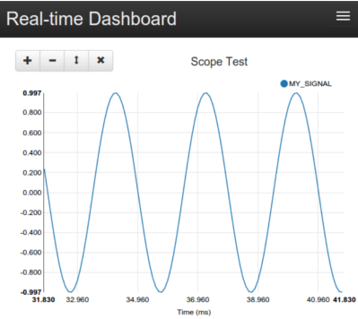

..  _getting_started:

Getting Started
===============
Zircon is a flexible tool that adapts well to individual use cases. Before you
start using it, look through the :ref:`System Overview <overview>` and get a
sense of what the component classes do and how they are connected together to make
a complete data pipeline from source to database to client application.

Zircon's built-in components will fit many needs out of the box, but with customization
can be adapted for nearly any scenario. The default datastore (InfluxDB), messaging
protocol (ZeroMQ), and client-side API (Socket.IO) used by Zircon's components provide
excellent speed and robustness.

Make sure to have a picture of what the following components should
be for your application:

* Transceivers (interfaces to your sources of data)
* Transformers (tasks - batching, formatting, [de]compression, [de]serialization, etc.)
* Client (end goal - just visualization, or integration into some system?)

The guide below outlines how to install Zircon and use it to store some programatically-generated
timeseries data at 2kHz and visualize it in real-time with the web dashboard. From there, it
is a simple matter to create a Transceiver for your own data source, run complex queries, and
build custom applications.

Installation
------------
.. note::

  Instructions are for Debian-based distributions. Many commands require root privileges.

1. Clone the repository.

.. code-block:: bash

  git clone https://github.com/hmartiro/zircon.git

2. Install required Python packages using ``pip``. I highly recommended using ``virtualenv`` and
   ``virtualenvwrapper`` to isolate the Python environment.

.. code-block:: bash

  cd zircon
  pip install -r requirements.txt

3. Install and start InfluxDB_, the default datastore. It should start automatically from now on.

.. code-block:: bash

  service influxdb start

4. Install ``bower`` for managing the frontend JavaScript libraries.

.. code-block:: bash

  apt-get install nodejs npm
  ln -s /usr/bin/nodejs /usr/bin/node # Quirk on ubuntu, node package was already taken
  npm -g install bower

5. Configure the ``PYTHONPATH`` and ``DJANGO_SETTINGS_MODULE`` environment variables. If using
   a ``virtualenv``, do this in your ``activate`` or ``postactivate`` script. Otherwise, source
   it from your ``~/.bashrc`` or similar.

.. code-block:: bash

  PYTHONPATH=$PYTHONPATH:/path/to/zircon
  DJANGO_SETTINGS_MODULE=zircon.frontend.settings

.. note::

  You should now be able to access Zircon from Python. Make sure ``import zircon`` works. Also,
  ``python -m zircon.frontend.manage`` is the entry point to Zircon's built-in Django application.
  You can interface with it on the command line.

6. Initialize the real-time web dashboard

.. code-block:: bash

  python -m zircon.frontend.manage syncdb
  python -m zircon.frontend.manage bower install

That's it for installation. You are ready to dive into Zircon!

.. _InfluxDB: http://influxdb.com/download/

Reporter Process
----------------
Copy the file ``zircon/tests/sample_reporter.py`` and open it up. This script
initializes and runs a
:ref:`Reporter <reporter>`. A Reporter is a class that collects data from a
:ref:`Transceiver <transceiver>`, processes it using a chain of
:ref:`Transformers <transformer>`, and broadcasts the processed data using a
:ref:`Publisher <publisher>`.

To create a Reporter, we simply initialize it with a Transceiver, a list of
Transformers, and a Publisher. Then, we call ``run()``.

.. code-block:: python

  reporter = Reporter(
      transceiver=..,
      transformers=[.., .., ..],
      publisher=..
  )
  reporter.run()

For this demo, we are using a
:class:`DummyTransceiver <zircon.transceivers.dummy.DummyTransceiver>`,
which generates a single
signal by sampling a given function. In our case, it invokes ``sine_wave(t)``
at the specified frequency of 1 kHz. We name this signal 'MY_SIGNAL'. The
output of the Transceiver is a tuple of the form (timestamp, name, value).

.. code-block:: python

  transceiver=DummyTransceiver(
      signal_name='MY_SIGNAL',
      data_gen=sine_wave,
      dt=1.0/freq
  )

Next, we specify three Transformers. The return value of the transceiver's
``read`` method is fed into each Transformer's ``push`` method, in a chain.

The first is a
:class:`TimedCombiner <zircon.transformers.common.TimedCombiner>`
, which batches
up the signals for more efficient transmission and database insertion. It reads
in all messages, and outputs them chunked up into a list on a given interval. Every
individual point at 1kHz is saved, but we save each set of 100 points as a group
at a rate of 10 Hz. Batching is not necessary, but it dramatically raises the
ceiling on achievable throughput. By default, the web dashboard downsamples the
data to 10 Hz, so there is no reason to transmit or insert at a faster rate. You
can tweak this based on your needs - if you need 20ms of latency, set the dt
of TimedCombiner to 0.02.

The next Transformers are a
:class:`Pickler <zircon.transformers.common.Pickler>`
and a
:class:`Compressor <zircon.transformers.common.Compressor>`.
The Pickler serializes the
output of the TimedCombiner using Python's ``pickle``, and the Compressor uses ``zlib``
to shrink the message and save on network bandwidth. If processing power is your
bottleneck rather than network bandwidth, you can skip the Compressor. These classes
are essentially one-liners, but having them as a Transformer interface makes them
awesome to plug and play. You can use any method of serialization, but the output
of the last Transformer must be a bufferable object (a string, usually).

.. code-block:: python

  transformers=[
      TimedCombiner(dt=0.1),
      Pickler(),
      Compressor()
  ],

Finally, the serialized data is broadcast by a Publisher to any processes that want
to listen. Zircon's default Publisher is the
:class:`ZMQPublisher <zircon.publishers.zmq.ZMQPublisher>`, which writes the data to
any subscribed entities, local or remote, using the ZeroMQ_ messaging protocol.

.. _ZeroMQ: http://zeromq.org/

Okay, enough talk. Are you ready to run the reporter process? Here it is:

.. code-block:: bash

  python sample_reporter.py

When you start it, you might see some output from the Publisher of how many messages
it is sending. Nothing else is happening, because nobody is listening yet. We need to
start another process, an :ref:`Injector <injector>`.

Injector Process
----------------
Copy the file
``zircon/tests/sample_injector.py`` and take a look at it. Like a Reporter, an Injector
has three components.

First, a Subscriber receives serialized messages from a Publisher. The Subscriber should
specify the network address of the Publisher (localhost is default). The default subscriber
is the
:class:`ZMQSubscriber <zircon.subscribers.zmq.ZMQSubscriber>`, which connects to the
ZMQPublisher.

Next, a series of Transformers are applied to the data, just like with the Reporter. Here,
we simply use a Decompressor to reverse the Compressor, and an Unpickler to reverse the Pickler.
The output of the Unpickler is a list of (timestamp, name, value) tuples as outputted by the
TimedCombiner.

.. code-block:: python

  injector = Injector(
      subscriber=ZMQSubscriber(),
      transformers=[
          Decompressor(),
          Unpickler(),
      ],
      datastore=InfluxDatastore()
  )
  injector.run()

Finally, our data is fed to a :ref:`Datastore <datastore>`. Datastores implement methods
to insert and query signal data. Each message outputted by the Unpickler is fed into the
``insert`` method of the Datastore.

Zircon's built-in Datastore is the
:class:`InfluxDatastore <zircon.datastores.influx.InfluxDatastore>`,
which uses InfluxDB, an extremely fast timeseries database with powerful
query capabilities. Our client applications interface with the Datatstore.

Now, start the Injector:

.. code-block:: bash

  python sample_injector.py

Start the Reporter up as well, and the Injector should output that it is saving around
90-95 points every 0.1 seconds, whatever the DummyTransceiver actually outputs at. Your
signal is now being saved into an InfluxDB database instance. If you like, you can explore
it directly using InfluxDB's
`web UI <http://influxdb.com/docs/v0.8/introduction/getting_started.html>`_. However, we
will be focusing on Zircon's dashboard.

Real-time Dashboard
-------------------
With your Reporter and Injector processes running, your sine wave is flowing into the Datastore.
We can visualize this signal using Zircon's web interface. The web interface provides a
general purpose solution for viewing signal data, and more importantly acts as an example
for how to build custom applications using Zircon.

Start the web interface using Django:

.. code-block:: bash

  python -m zircon.frontend.manage runserver_socketio 0.0.0.0:8000

Navigate to ``http://localhost:8000/``. You should see a blank page with a header bar. Click the
'+' button in the upper-right corner to add a scope, and name it 'my_scope'. Now, click the '+'
in the scope to add a signal, 'MY_SIGNAL'.

You should now see your glorious sine wave! It is being dynamically sampled at 100ms by default,
from the Datastore. You can play around with the plot controls, mouse-over to see the values, and
pause/play the scope from the top bar. Note, the scope configuration is encoded in the URL, so
you can copy and paste it to save configurations.

There are two Django apps running here - the ``datasocket`` and the ``dashboard``. The ``datasocket``
provides a Socket.IO API directly to the Datastore. The ``dashboard`` acts as a client to the
``datasocket``. The client-side JavaScript in ``dashboard`` opens up a connection to the Socket.IO
API and requests data for the signals the user has selected.

You can browse the code at ``zircon/zircon/frontend``.

Onward
------
Hopefully, you now understand how the Zircon stack works! Here are some things you can try:

* Run your Reporter and Injector processes on different machines. Just specify the IP address
  to the ZMQSubscriber, like ``ZMQSubscriber(host='192.168.1.45')``.
* Query the Datastore programatically, just by initializing an instance of
  :class:`InfluxDatastore <zircon.datastores.influx.InfluxDatastore>`. You can take a look at
  ``zircon/zircon/utils/export.py`` for an example. You can query for something like the
  mean of a signal value, for a given hour, in 1 second buckets.
* Monitor six signals at once, using ``zircon/tests/noisy_imu_reporter.py``.
* Take a look at some common Transformers in ``zircon/zircon/transformers/common.py``.
* See how high of a throughput you can get, or how low of a latency. You can play around with
  the dashboard code at ``zircon/zircon/frontend/dashboard/static/dashboard/js/dash.js``. In
  particular, play with the ``data_frametime`` and ``view_frametime`` variables.

Create a Transceiver that reads from your sensor! Just extend BaseTransceiver and implement
the ``read()`` method. Zircon can be useful for anything from Arduino signals to events in
a distributed network.
