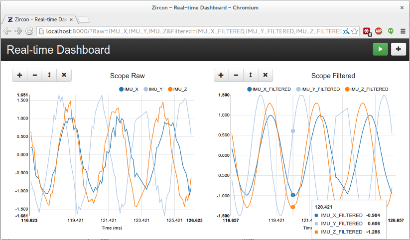

Introduction to Zircon
======================

Zircon is a lightweight framework to intercept, store, analyze, and visualize
high-speed signals in real-time using modern technologies. High-speed means
thousands of messages per second and real-time means a latency of milliseconds
to tens of milliseconds.

Purpose
-------

Zircon is designed to capture rapid streams of data in large communication
networks like CAN busses and wireless meshes. This usually means sensor and
actuator signals, but can be anything that boils down to events or time series.
Zircon consists of pluggable components useful individually or as a full stack
for decoding and logging, structured querying and analysis, real-time
visualization, and integration into custom applications. Written in Python,
with a small and elegant code base.

Zircon is free and open-source, fast, platform-independent, fully extensible,
and easy to integrate with your system. By default, InfluxDB is used for
blazing-fast storage, ZeroMQ for local or remote reporting, and Socket.IO for
real-time data streaming. It provides base classes and examples that can be
extended to support any protocol or encoding.

Application Example
-------------------

Steve is the lead engineer for a new hovercraft, which contains ECUs for
propulsion, steering, sensing, power, and safety systems on a CAN bus. Every
day, Steve's engineers test and debug their respective systems through the
messages they send and receive. The team has various expensive, bulky, archaic,
and/or proprietary software options to filter and log messages, but they still
spend a lot of time watching the stream and manually decoding bytes. Or worse,
they pull raw data from log files and hunt for something meaningful.

Steve installs Zircon on his laptop, writes a little code, and fires it up.
What he instantly gets is a slick web interface to visualize all communications
inside his hovercraft, in real-time. What he also gets is a powerful API to
query, filter, downsample, aggregate, and export all signals for the past days
or weeks. Excited, Steve sets up Zircon on a dedicated machine. His engineers
start using the Zircon interface to wirelessly debug their firmware, tune the
control gains, and check for voltage spikes. Soon, they create custom
diagnostic dashboards, an interactive driver display, and a mobile app that
can start the hovercraft by sending messages back to the bus. Productivity
soars, and profit is made.
